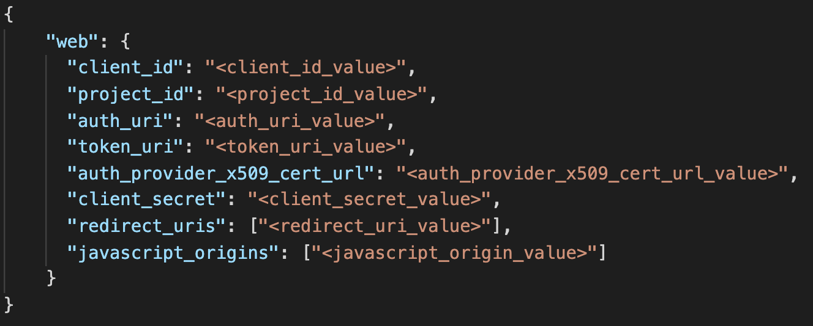

# Easy Read
## Table of contents

&emsp;[1- Why Easy Read](#whyEasyRead)\
&emsp;[2- Project Demo](#projectDemo)\
&emsp;[3- Run this project](#runThisProject)\
&emsp;&emsp;[3-1- Prerequisites](#prerequisites)\
&emsp;&emsp;[3-2- Create a project at Google API Console](#step1)\
&emsp;&emsp;[3-3- Create the required Docker secrets](#step2)\
&emsp;&emsp;[3-4- Build the Docker images](#step3)\
&emsp;&emsp;[3-5- Deploy the project](#step4)\
&emsp;[4- Features to Add in future](#featuresToAdd)

 

## <a id="whyEasyRead">1- Why Easy Read</a>

Today Email is the most widely used tool for business communication. It is the most immediate method of communication for many professionals. We read at least 40-50 emails a day on an average. And it would be easier if we can read our emails just as we read a conversation on messenger or on whatapps. So I decided to create EasyRead to display emails communication like messenger or whatapps conversations.

## <a id="projectDemo">2- Project Demo</a>
<Drap and drop the video on github>

## <a id="runThisProject">3- Run this project</a>
### <a id="prerequisites">3-1- Prerequisites</a>

 - **Docker**: I am currently using version *20.10.7*
 - **Docker swarm**: Initialize a new swarm with `docker swarm init` or join an existing swarm with `docker swarm join`

### <a id="step1">3-2- Create a project at Google API Console</a>
You should visit [Google Developers Console](https://console.developers.google.com/) to create a project and enable the read only access for email messages. The 4 required steps to achieve that are on [Google Workspace for Developers > Guides](https://developers.google.com/workspace/guides/getstarted-overview). 

The output of this step is the OAuth2 client credentials file. The schema of the credentials file is shown bellow : 

### <a id="step2">3-3- Create the required Docker secrets</a>
The project expects three docker secrets: 

 - **secret_google_client_credentials**: This secret should contains the OAuth2 client credentials. The expected format is shown at the [Step 1](#step1). \
 Use bellow command to create this secret: \
 ` docker create secret secret_google_client_credentials PATH_TO_THE_CREDENTIALS_FILE `
 
 - **secret_mysql_root_password**: This secret should contains the password that you want for the root use of the MySQL database that will be created. \
 Use bellow command to create this secret: \
 `echo ROOT_PASSWORD | docker create secret secret_mysql_root_password -`

 - **secret_mysql_password**: This secret should contains the password that you want for the MySQl database user used by the Spring boot application. \
 Use belloe command to create this secret: \
 `echo MYSQL_USER_PASSWORD | docker create secret secret_mysql_password -`

### <a id="step3">3-4- Build the Docker images</a>
**Docker Stack** currently ignore the **build** command present in **docker compose** file. So you have to build the docker images first before you can deploy them with **docker stack**. \
Use bellow command to build the docker images: \
`cd PROJECT_ROOT_DIRECTORY && docker-compose build`

### <a id="step4">3-5- Deploy the project</a>
You are now ready to deploy the project and start reading our emails messages just as you read our Whatapps or Messenger conversation. \
Use bellow command to deploy the project: 
`cd PROJECT_ROOT_DIRECTORY && docker stack deploy -c docker-compose.yml esay-read-stack` \
You can access the project at: http://localhost:80/

## <a id="featuresToAdd">4- Features to Add in future</a>
Of course we can make this project more fun by adding the following features: 

 - Allow to enter multiples emaiil addresses to emulate a group dicsussion view of the email messages
 - Add an advanced search option to include or not CC emails
 - Add the ability to respond to an email

Please feel free to make a contribution to this project if you found it fun.
